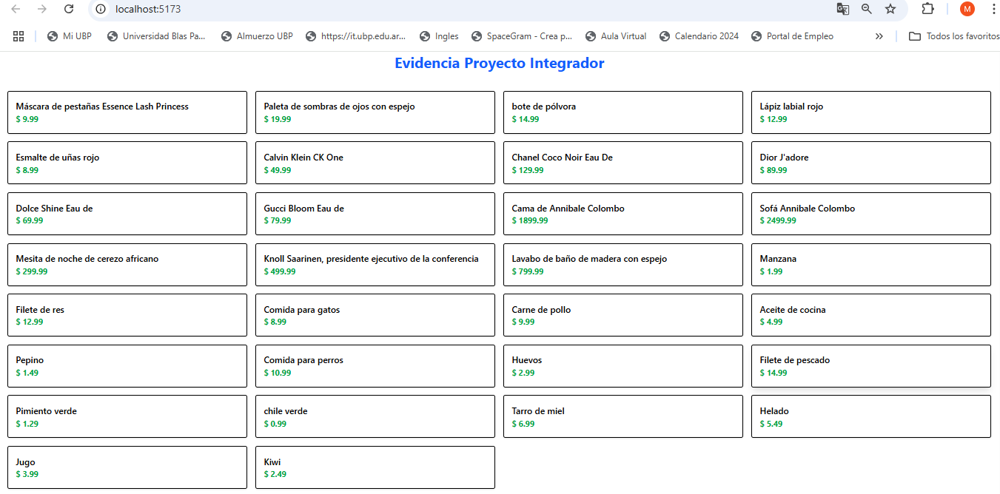

# Evidencia Proyecto Integrador

Este proyecto fue creado con **Vite + React**, utiliza **Tailwind CSS** para los estilos y **Axios** para consumir una API externa.

## Tecnologías utilizadas
- Node
- Vite 
- React
- JavaScript + SWC
- Tailwind CSS
- Axios

## ¿Cómo ejecutar el proyecto?

1. Cloná o descargá este repositorio o carpeta.
2. Abrí la terminal en la carpeta del proyecto.
3. Ejecutá este comando para instalar las dependencias con npm i
4. Luego, iniciá la app con:

- Abrí el navegador y entrá en:  
[http://localhost:5173](http://localhost:5173)

## ¿Qué hace la aplicación?

- Muestra una lista de productos obtenidos de la API [https://dummyjson.com/products](https://dummyjson.com/products)
- Usa React (con `useState` y `useEffect`) para manejar los datos
- Usa Tailwind CSS para aplicar estilos

## Captura de pantalla

